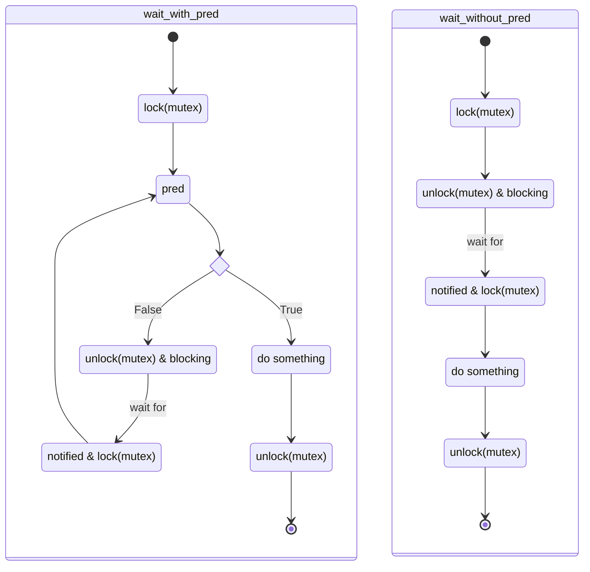

# C++STL并发库

## 线程（def in `<thread>`）

- thread(c++11)
  - 在析构时自动终止。
  - join（阻塞等待线程完成），detach（分离线程）。
  - 命名空间`this_thread`：get_id，yield（重新调度），sleep_for，sleep_until。
  - 不可复制，可以移动。
- jthread(c++20)：相比于thread，jthread有额外的私有成员。
  - 在析构时会自动join。
  - 能够支持线程的中断（接收主线程的中断信息）。

## 原子操作（def in `<atomic>`）

### 原子类型

- atomic：布尔，整数，浮点数（c++20），指针。
- atomic_ref：非原子对象的原子操作。

| 原子类型上的操作                                         | 解释                                                         | 版本  |
| -------------------------------------------------------- | ------------------------------------------------------------ | ----- |
| atomic_is_lock_free                                      | 检查是否免锁                                                 | C++11 |
| atomic_store                                             | 将非原子的值赋值给原子对象                                   | C++11 |
| atomic_load                                              | 获取原子对象的值                                             | C++11 |
| atomic_exchange                                          | 将非原子的值赋值给原子对象，返回原子对象的旧值。       | C++11 |
| atomic_compare_exchange_weak(\*obj, \*expected, desired) | 如果\*obj==\*expected，则obj=desired，否则\*expected=*obj    | C++11 |
| atomic_compare_exchange_strong                           | 相较于weak版本，weak版本可以容忍假性失败（实际相等，判断为不相等），strong版本不会出现这种情况。 | C++11 |
| atomic_fetch_add                                         | 原子对象+=非原子对象，返回原子对象旧值（下同）               | C++11 |
| atomic_fetch_sub                                         |                                                              |       |
| atomic_fetch_and                                         |                                                              |       |
| atomic_fetch_or                                          |                                                              |       |
| atomic_fetch_xor                                         |                                                              |       |
| atomic_wait(\*obj, old)                                  | 若\*obj\=\=old，则阻塞直到atomic_notify_one或atomic_notify_all且\*obj!\=old | C++20 |

### 原子标志类型

- atomic_flag：是一种原子布尔类型
  - 与`atomic<bool>`的区别：不提供store或load。

| 原子标志类型操作         | 解释                 | 版本  |
| ------------------------ | -------------------- | ----- |
| atomic_flag_clear        | 设置为false          | C++11 |
| atomic_flag_test_and_set | 设置为true且返回旧值 | C++11 |
| atomic_test              | 返回值               | C++20 |
| atomic_flag_wait         | 阻塞直到被唤醒且更改 | C++20 |

### 注意事项

- 所有操作函数都可以视为对应原子对象的方法。
- `atomic_xxx_explicit`：所有操作函数都有explicit版本指定内存定序约束（memory_order）。

## 内存同步顺序

Todo

## 互斥（def in `<mutex>`）

### 互斥类型

- mutex
- timed_mutex：时间限定。
- recursive_mutex：可以被同一线程递归锁定。
- recursive_timed_mutex

### 通用互斥管理

| 通用互斥管理类型 | 解释                             | 版本  |
| ---------------- | -------------------------------- | ----- |
| lock_guard       | RAII风格，不可手动释放           | C++11 |
| scoped_lock      | RAII风格，同时获取多个锁，防死锁 | C++17 |
| unique_lock      | 可以手动释放                     | C++11 |

```c++
std::scoped_lock slk(m1,m2);
//等价lock_guard实现
std::lock(m1,m2);
std::lock_guard<std::mutex> lkg1(m1, std::adopt_lock);
std::lock_guard<std::mutex> lkg2(m2, std::adopt_lock);
//（不完全）等价unique_lock实现
std::unique_lock<std::mutex> ulk1(m1, std::defer_lock);
std::unique_lock<std::mutex> ulk2(m2, std::defer_lock);
std::lock(ulk1,ulk2);
```

- adopt_lock：假设调用时已经获取了锁（帮助锁在析构时释放）。
- defer_lock：不获取锁的所有权。
- try_to_lock：尝试获取锁的所有权但不阻塞。

| 通用锁定操作 | 解释                                     | 版本  |
| ------------ | ---------------------------------------- | ----- |
| try_lock     | 尝试对所有锁try_lock，一个失败则释放所有 | C++11 |
| lock         | 对所有锁lock，失败则阻塞，防死锁         | C++11 |

### 单次调用

- call_once

### 共享互斥类型（def in `shared_mutex`）

- shared_mutex(C++17)
- shared_timed_mutex(C++14)

| 共享互斥管理类型 | 解释           | 版本  |
| ---------------- | -------------- | ----- |
| shared_lock      | 共享锁（读锁） | C++14 |

共享互斥类型的特点：

1. 如果一个线程获取了独占锁，则其他线程无法获得该锁（包括独占和共享）。
2. 如果没有线程获取了独占锁，则共享锁可以被多个线程获取。
3. 一个线程同一时刻只能获取一个锁（独占或共享）。

简而言之：一个写锁，多个读锁。

## 条件变量（def in `condition_variable`）

条件变量应与互斥量一起使用：



故：使用条件变量的互斥量需要使用unique_lock（可以手动释放）

- condition_variable：只能与unique_lock关联
- condition_variable_any：与任何锁关联

| 条件变量操作   | 解释                 | 版本  |
| -------------- | -------------------- | ----- |
| wait(lk)       | 阻塞，释放锁（右图） | C++11 |
| wait(lk, pred) | 唤醒后再判断（左图） |       |
| wait_for       |                      | C++11 |
| wait_until     |                      | C++11 |
| notify_one     | 唤醒一个             | C++11 |
| notify_all     | 唤醒全部             | C++11 |

## 信号量（def in `semaphore`）

轻量同步原件，比条件变量更有效率。

- counting_semaphore：非负
- binary_semaphore：0-1

| 信号量操作        | 解释                         | 版本  |
| ----------------- | ---------------------------- | ----- |
| release           | 信号量+1，尝试唤醒阻塞的线程 | C++20 |
| acquire           | 尝试-1，不能减少则阻塞       | C++20 |
| try_acquire       | 尝试-1，不阻塞               | C++20 |
| try_acquire_for   |                              | C++20 |
| try_acquire_until |                              | C++20 |

## 锁存器（def in `latch`）与屏障（def in `barrier`）

- latch：只能（原子）减少的计数器，只能在创建时初始化值。

| 锁存器操作      | 解释                | 版本  |
| --------------- | ------------------- | ----- |
| count_down      | 计数器-1            | C++20 |
| try_wait        | 计时器为0则返回true | C++20 |
| wait            | 阻塞直到计数器为0   | C++20 |
| arrive_and_wait | 计数器-1并wait      | C++20 |

- barrier：阶段同步点，构造时确定期待计数expect，函数f，当计数减少到0时恢复到expect（会被arrive_and_drop影响）并开始下一阶段。

| 屏障操作        | 解释               | 版本  |
| --------------- | ------------------ | ----- |
| arrive          | 计数器-1           | C++20 |
| wait            | 阻塞，直到下一阶段 | C++20 |
| arrive_and_wait | 计数器-1并wait     | C++20 |
| arrive_and_drop | 计数器-1且expect-1 | C++20 |

## Future（def in `Future`）

Future用于获取异步任务的返回值（或异常）。

Future可以理解为一个未来会有值的变量（由async，promise，packaged_task产生）。

1. async：异步任务

   `launch::async`：新线程异步任务。

   `launch::dererred`：首次调用结果时执行任务（惰性求值）。

   位掩码枚举：可以使用`launch::async|launch::dererred`，同时传递两个策略。

   ```c++
   std::future<int> f1 = std::async(std::launch::async, [](){ return 8; });
   ```

2. promise：传输一个值（异常）到future

   ```c++
   std::promise<int> p;
   std::future<int> f2 = p.get_future();
   std::thread( [&p]{ p.set_value_at_thread_exit(9); }).detach();
   ```

3. packaged_task：封装可调用对象

   ```c++
   std::packaged_task<int()> task([](){ return 7; }); // 包装函数
   std::future<int> f1 = task.get_future();  // 获取 future
   std::thread(std::move(task)).detach(); // 在线程上运行
   ```
