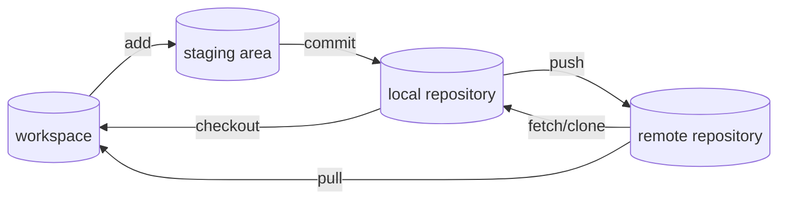
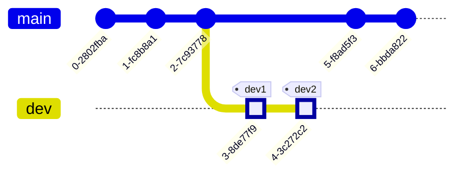
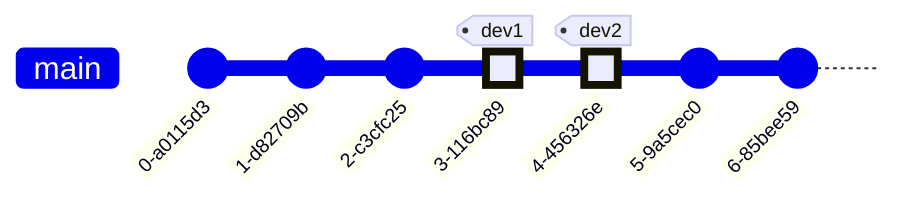
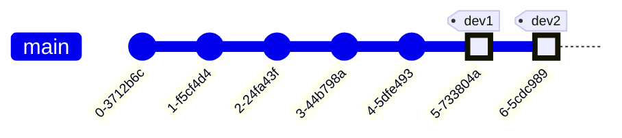

# Git

## 0.Github连接问题

### 修改hosts文件

1. 文件地址

   [`C:\Windows\System32\drivers\etc\hosts`](C:\Windows\System32\drivers\etc\)

2. 添加内容（内容会改变）

   ```txt
   140.82.113.3 github.com
   199.232.69.194 github.global.ssl.fastly.net
   185.199.108.153 assets-cdn.github.com
   185.199.109.153 assets-cdn.github.com
   185.199.110.153 assets-cdn.github.com
   185.199.111.153 assets-cdn.github.com
   ```

3. 内容获取

   Line1：[Github网址IP地址](https://github.com.ipaddress.com/)

   Line2：[Github域名IP地址](https://fastly.net.ipaddress.com/github.global.ssl.fastly.net)

   Line3-6：[Github静态资源IP地址](https://github.com.ipaddress.com/assets-cdn.github.com)

### 刷新DNS缓存

在cmd中执行`ipconfig/flushdns`命令

## 1.基本信息

**Git**分为远程仓库、本地仓库（暂存区）、工作区



- 远程仓库：储存在云端，一般用于与他人共享。
- 本地仓库：储存在本地的项目文件夹`.git`
  - 暂存区：一般存放在`.git/index`中
  - `HEAD`：命令中的HEAD指向最新版本，以下称为版本库。
  - `HEAD^(HEAD~)`：均表示最新版本的上一个版本，加数字可表示前x个版本，用法等同于版本id。
- 工作区：通过vscode等软件中打开的文件。

## 2.常用命令

[参考视频](https://www.bilibili.com/video/BV1HM411377j)

### 初始化命令

```shell
git config --global user.name "用户名"
git config --global user.email "邮箱"
# 保存用户名和密码
git config --global credential.helper store
git config --list
```

### 本地仓库相关命令

#### 创建本地仓库

```shell
# 从当前地址创建
git init
# 查看状态（分支名称，工作区文件、暂存区文件状态等）
git status
# 将工作区的文件添加到暂存区
git add .(所有文件)/文件名 #可以使用通配符
# 将暂存区的内容添加到版本库，*必加*备注信息
git commit -m "备注信息"
git commit -am "备注信息" #同时执行了git add .
```

#### 查看提交日志

```shell
# 查看提交日志
git log
# 同时显示每次提交修改的文件
git log --stat
# 简洁提交日志
git log --oneline
# *****在reset后查看历史操作记录*****
git reflog
```

#### 回退版本

```shell
# 回退到某个版本（保留工作区和暂存区）
git reset --soft <版本id>
# 回退到某个版本（不保留工作区和暂存区）
git reset --hard <版本id>
# 回退到某个版本（只保留工作区）
git reset --mixed <版本id>
# *****回退reset命令操作*****
# 查看操作的log，找到版本id，再使用reset
git reflog
```

#### 查看版本差异（一般使用图形化插件）

```shell
# 查看工作区和暂存区之间差异
git diff
# 查看工作区和版本库之间的差异
git diff HEAD
# 查看暂存区和版本库之间的差异
git diff --cached
# 查看特定版本之间的差异
git diff <版本id1> <版本id2>
# 查看特定文件的差异
git diff ... <file>
# 查看分支差异
git diff <分支名1> <分支名2>
```

#### 删除文件

系统自带删除：只对工作区生效，需要再`git add .`来同步暂存区。

```shell
# 同时删除工作区和暂存区，需要提交到版本库
git rm <file>
# 仅移出暂存区
git rm --cached <file>
```

### .gitignore文件（忽略文件）

.gitignore文件中可以输入（匹配的）文件名，文件夹。

使用glob模式匹配：

- `*`：通配任意字符
- `?`：匹配单个字符
- `[]`：匹配其中的单个字符
  - `[abc]`：匹配a/b/c
  - `[0-9]`：任意一个数字
  - `[a-z]`：任意一个字母
- `**`：匹配任意中间目录
- `!`：取反匹配

建议ignore的文件：

- 系统或软件自动生成的文件
- 编译产生的中间文件和结果文件
- 运行时生成的日志文件，缓存文件，临时文件
- 涉及身份、密码、口令等敏感信息文件

注意：不会影响已经提交到版本库中的文件。

[github](https://github.com/github/gitignore)上有常用语言的.gitignore文件的模板。

### 远程仓库相关命令

#### 通过SSH的方式连接远程仓库

```shell
cd ~/.ssh
#使用rsa生成4096bit的密钥
ssh-keygen -t rsa -b 4096
#回车后输入密钥文件名（如果不是默认名称，还需要修改配置文件）
#将.pub公钥文件设置到github/gitee等网站
```

```shell
#~/.ssh/config
Host github
    HostName github.com #ip或地址
    PreferredAuthentications publickey
    IdentityFile ~/.ssh/id_rsa # 认证文件 私钥地址
```

#### clone远程仓库

```shell
git clone "远程仓库地址"
```

#### 同步远程仓库

```shell
# 将本地仓库的内容推送到远程仓库
git push "远程仓库地址" [分支名]
# 将远程仓库的内容拉取到本地仓库
git pull "远程仓库地址"
```

#### 关联远程仓库

```shell
# 关联远程仓库 origin是默认的远程仓库名，会在本地创建远程仓库备份
git remote add origin "远程仓库地址"
# 查看关联的远程仓库
git remote -v
# 推送到关联的远程仓库 本地分支名和远程分支名相同可忽略冒号后的内容
git push -u <远程仓库名> <本地分支名>:<远程分支名>
# 拉取远程仓库的修改，到本地的远程仓库以及本地仓库 可能存在冲突
git pull <远程仓库名> <远程分支名>:<本地分支名>
# 获取远程仓库的修改，到本地的远程仓库，此时不会产生冲突 再使用merge等合并本地仓库并解决冲突
git fetch <远程仓库名> <远程分支名>
git merge FETCH_HEAD
```

#### 分支相关命令

```shell
# 创建分支
git branch <分支名>
# 查看分支
git branch
# 切换分支
git switch <分支名> #建议
git checkout <分支名> #还有恢复的功能，可能会有歧义
git checkout -b <分支名> <版本id> #创建/恢复分支并切换到创建的分支
# 合并分支，会默认进行分支暂存区的提交，不会删除分支
git merge <分支名>
# 查看分支图
git log --graph --oneline --decorate --all
# 删除分支，-d暂存区中没有内容，-D强制删除
git branch -d <分支名>
```

#### 解决合并冲突（merge）

在主分支上进行合并，结果：进行merge的分支多了一次提交记录。

```shell
git merge <分支名>
# 此时产生合并冲突
# 查看产生冲突的内容
git status
git diff
# *手动修改*产生冲突的文件
# 添加暂存并提交

# 终止合并
git merge --abort
```

#### 解决合并冲突（rebase）

可以在任意分支进行rebase，结果：进行rebase的分支（截至公共祖先）接到了被rebase的分支后。



```shell
git switch main
git rebase dev
```



```shell
git switch dev
git rebase main
```



```shell
git rebase <分支名>
```

#### merge和rebase的对比

merge优点：不会破坏原分支的提交历史，方便回溯和查看。

merge缺点：会产生额外的提交节点，分支图比较复杂。

rebase优点：不会产生额外的提交记录，比较整洁。

rebase缺点：改变了提交历史，避免在共享分支中使用。
