# Mermaid

[官方文档](https://mermaid.nodejs.cn/syntax/flowchart.html)

## 流程图

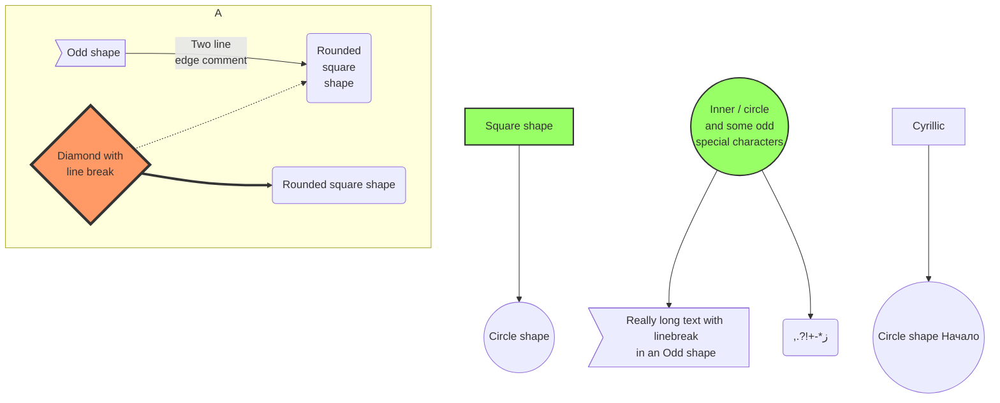

## 序列图

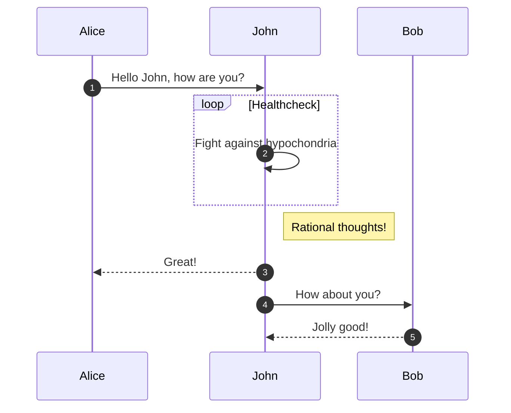

## 类图

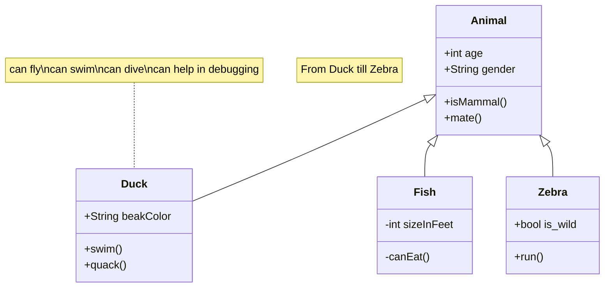

## 状态图

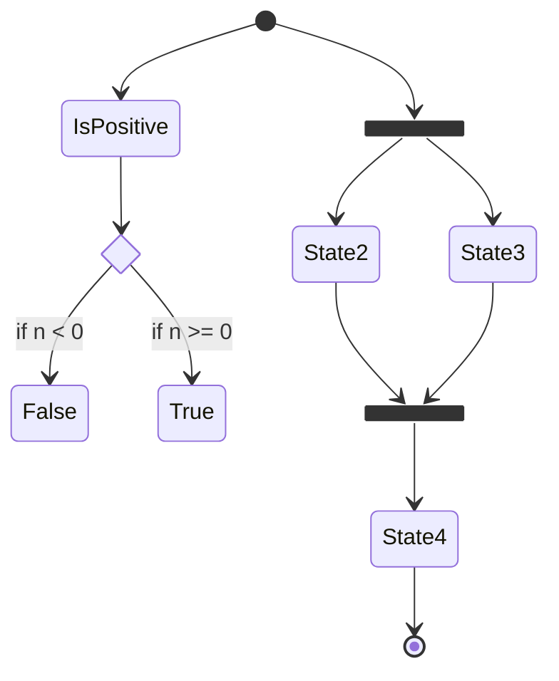

## 实体关系图

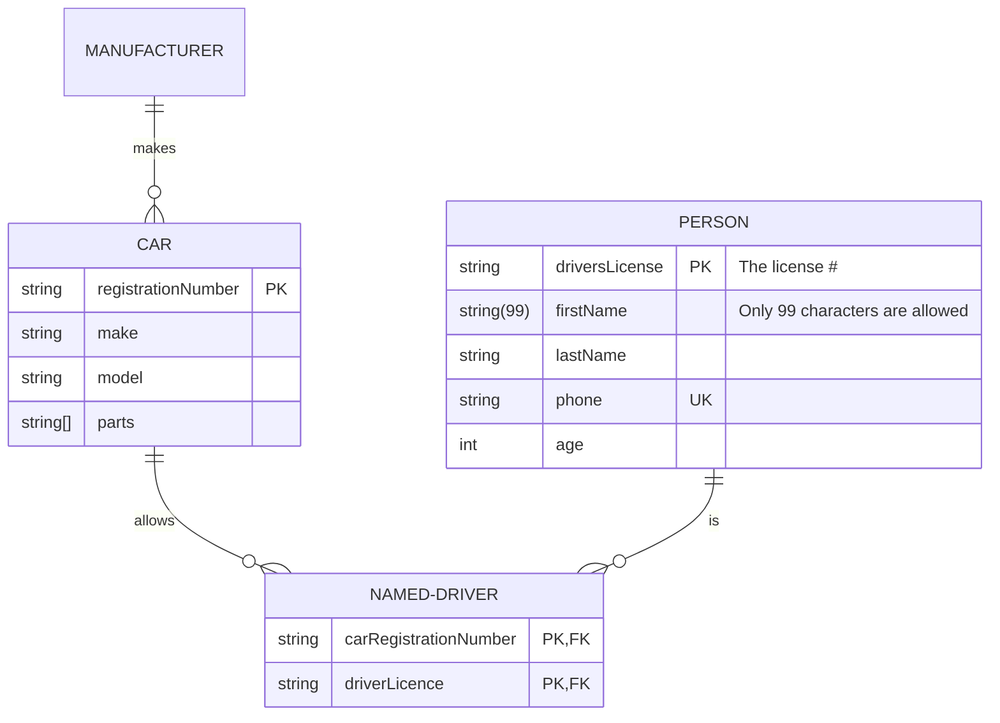

## 用户旅程图

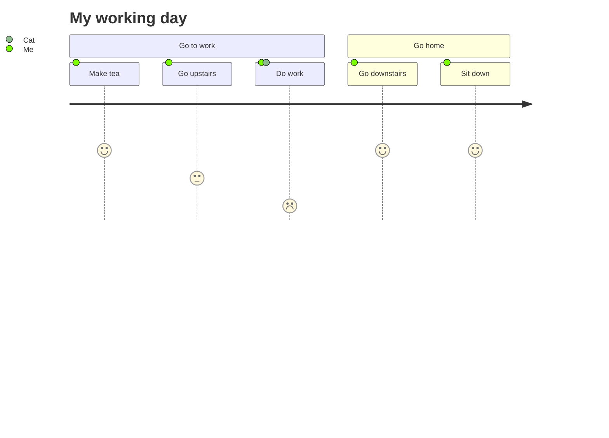

## 甘特图

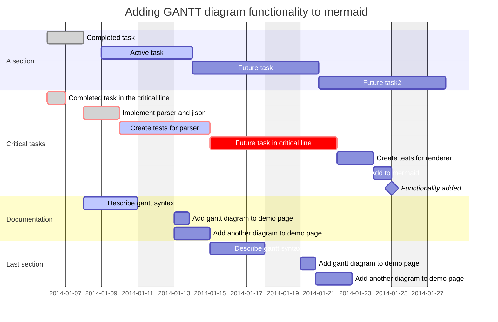

## 饼图

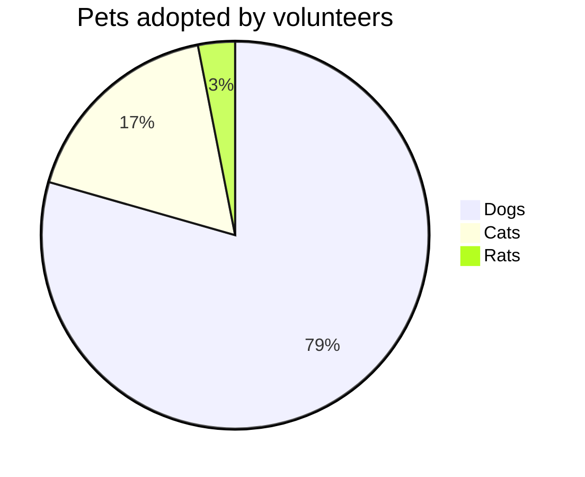

## 象限图

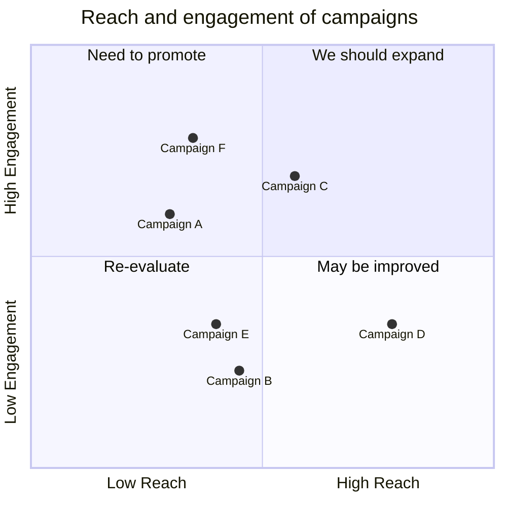

## 需求图

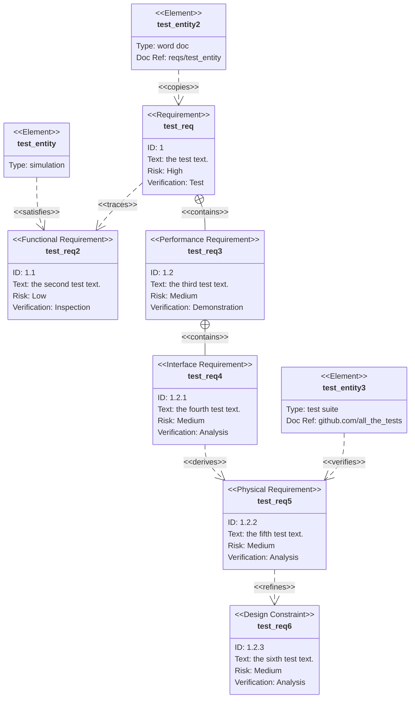

## Gitgraph

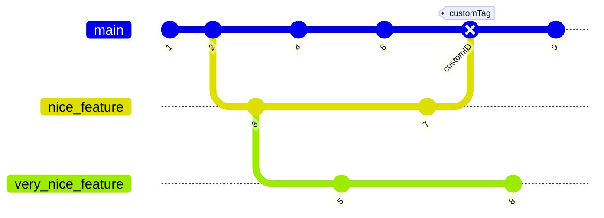

## 思维导图

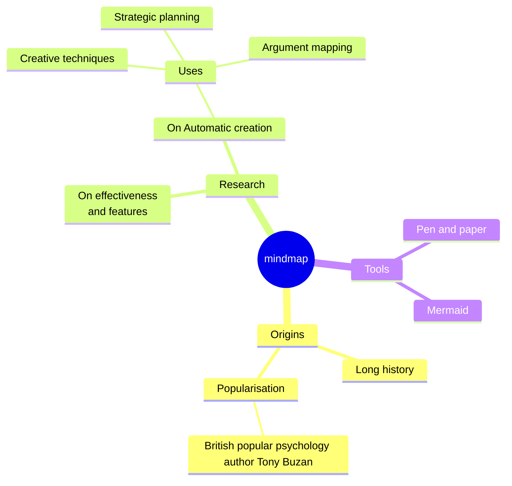

## 时间线图

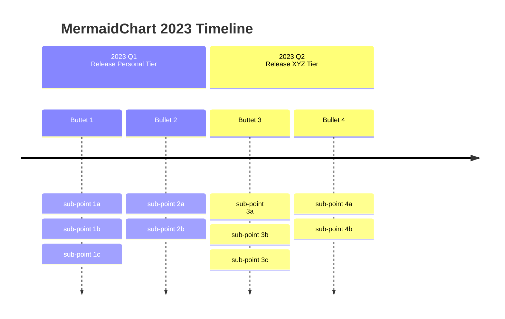

## 桑基图

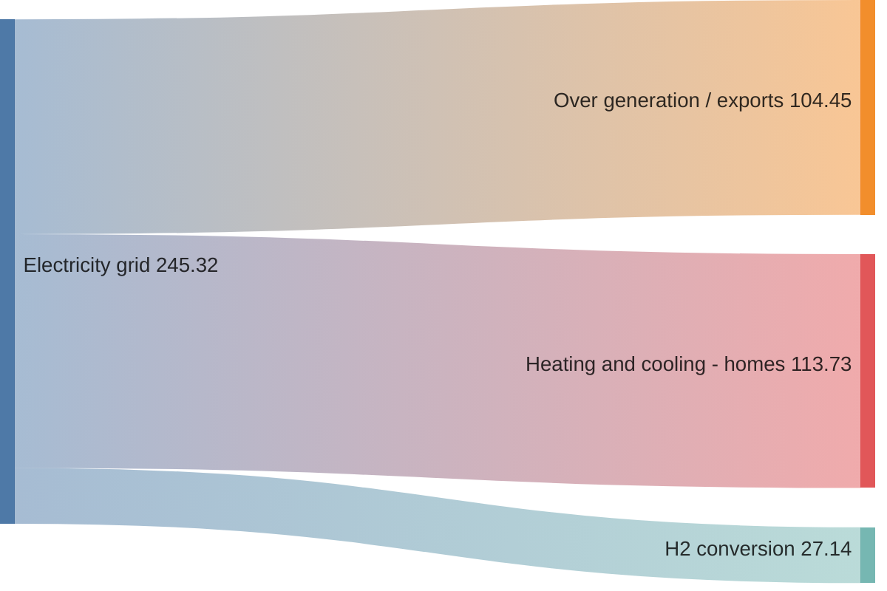
