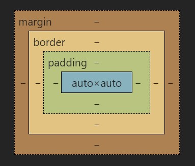

# CSS

## 1.基础语法

```css
/*
选择器名 {
  属性:属性值;
  ......
}
css不报错，注意书写规范。
*/
p {
  color: red;
  font-family: 楷体;
}
```

## 2.CSS 的使用

```html
<!--行内式，定义在标签的sytle属性中-->
<p style="color:red;font-family:楷体;">行内式</p>
<!--嵌入式，一般定义在<head>标签中-->
<head>
  <!--其他部分-->
  <style type="text/css">
    p {
      color: red;
      font-family: 楷体;
    }
  </style>
</head>
<!--外部式，引用外部css文件-->
<link rel="stylesheet" type="text/css" href="css/style.css" />
<!--
  样式的优先级
  行内最高，嵌入与外部由顺序j
-->
```

## 3.基本选择器

```css
/*通用选择器（选择所有元素）
    * {
        属性名:属性值
    }
*/
* {
  color: #0000ff;
}
/*元素选择器（选择指定元素/标签）
    标签名 {
        属性名:属性值
    }
*/
div {
  background-color: #faebd7;
}
/*id选择器（选择指定id值的元素）id值一般不重复
    #id属性值 {
        属性名:属性值
    }
*/
#div1 {
  color: #ff0000;
}
/*class选择器（选择指定class值的元素）
    .class属性值 {
        属性名:属性值
    }*/
.cls1 {
  font-weight: bold;
}
/*分组选择器（多个选择器）
选择器1,选择器2,... {
    属性名:属性值
}*/
#div1,
.cls1,
p {
  border: 1px solid #0000ff;
}
/*选择器的优先级
  id选择器(100)>class选择器(10)>元素选择器(1)>通用选择器(0)
  行内样式 style属性 权重1000
*/
/*伪类选择器，根据元素状态修改样式
  :link 链接点击前
  :visited 链接点击后
  :hover 鼠标悬停
  :active 鼠标按下s
*/
a:hover {
  /*鼠标悬停到超链接上时*/
  font-width: bold;
}
```

## 4.组合选择器

```css
/*
  后代选择器（选择指定元素1的后代元素中的指定元素2，包括下一代...下n代）
    选择器1 选择器2
  子代选择器（选择指定元素1的子代元素中的指定元素2，下一代）
    选择器1>选择器2
  相邻兄弟选择器（选择指定元素1的同代元素中的相邻下一个指定元素2）（若相邻的下一个不是指定元素2，则无效）
    选择器1+选择器2
  普通兄弟选择器（选择指定元素1的同代元素中的向后所有指定元素2）
    选择器1~选择器2
*/
/*选择器可以多个相连*/
.ul1 li a {
  ...;
}
```

## 5.常用属性设置

```css
/*背景*/
body {
  /*背景颜色*/
  background-color: #0000ff;
  /*背景图片，默认重复平铺*/
  background-image: url(img.jepg);
  /*设置背景图片是否重复no-repeat/repeat-x/repeat-y/repeat*/
  background-repeat: repeat;
  /*设置背景图片的大小*/
  background-size: 200px 200px;
  background-size: auto 200px;
}
/*文本*/
body {
  /*文本颜色，三种方式*/
  color: blue;
  color: #00ff00;
  color: rgb(255, 0, 0);
  /*对齐方式center/right/left*/
  text-align: center;
  /*文本修饰overline/underline/line-through/none(去除修饰)*/
  text-decoration: overline underline;
  text-decoration: none;
  /*首行缩进效果em:文字高度*/
  text-indent: 2em;
}
/*字体*/
body {
  /*设置字体，可以设置备用字体，生效顺序从前向后*/
  font-family: 楷体, "angency fb";
  /*设置字号*/
  font-size: 30px;
  /*设置字体风格normal(正常)/italic(斜体)/oblique(强制倾斜)*/
  font-style: italic;
  /*设置字体粗细bold/100~900(400为正常，700为bold)*/
  font-weight: bold;
}
/*对齐方式*/
body {
  /*水平对齐方式left/right/center/justify*/
  text: justify;
}
/*display属性，规定元素生成框的类型*/
body {
  /*none(隐藏)/block(块级)/inline(行内)/inline-block(行内块级)*/
  display: inline-block;
}
/*浮动，使块级元素横向浮动，在同一行显示*/
body {
  /*none/left/right*/
  float: left;
  /*也可实现文字围绕图片*/
}
```

## 6.盒子模型



padding：内边距，文字内容到边框的距离

border：边框的宽度

margin：外边距

```css
/*border*/
body {
  /*设置宽度、颜色、类型*/
  border: 2px #0000ff dotted;
  border-width: 2px;
  border-color: #0000ff;
  border-style: dotted;
  /*若要对上下左右四条线分别设置，可以增加参数*/
  border-width: 1px 2px; /*上下为1px，左右为2px*/
  border-width: 1px 2px 3px; /*上为1px，左右为2px，下为3px*/
  border-width: 1px 2px 3px 4px; /*上为1px，右为2px，下为3px，左为4px*/
  /*规律为按照上右下左的顺序，没有参数就参照对边的设置*/
  /*设置圆角，顺序为左上、右上、右下、左下*/
  border-radius: 0 10px;
  /*设置表格边框是否合并separate(不合并)(default)/collapse*/
  border-collapse: collapse;
}
/*padding*/
body {
  /*设置宽度*/
  /*规律为按照上右下左的顺序，没有参数就参照对边的设置*/
  padding: 10px 20px;
  /*单独各边*/
  padding-top: 10px;
  padding-right: 10px;
  padding-bottom: 10px;
  padding-left: 10px;
}
/*margin*/
body {
  /*设置宽度*/
  /*规律为按照上右下左的顺序，没有参数就参照对边的设置*/
  margin: 10px 20px;
  /*单独各边*/
  margin-top: 10px;
  margin-right: 10px;
  margin-bottom: 10px;
  margin-left: 10px;
}
```
