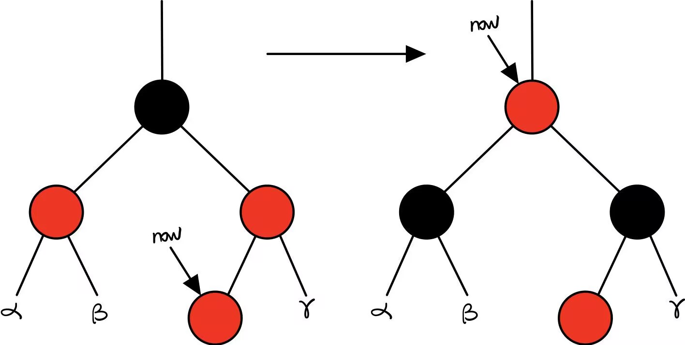
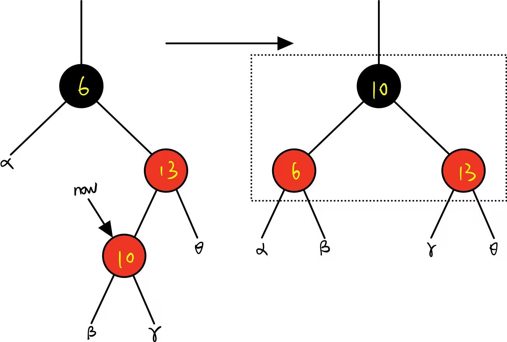
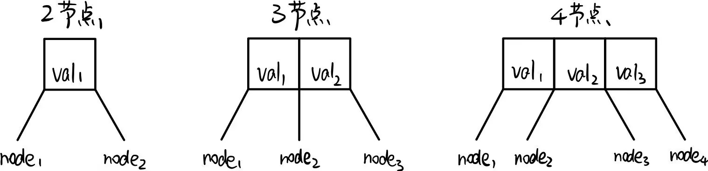
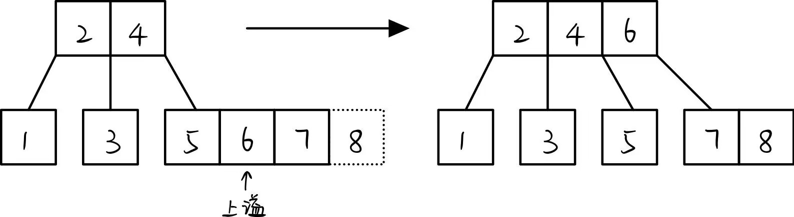
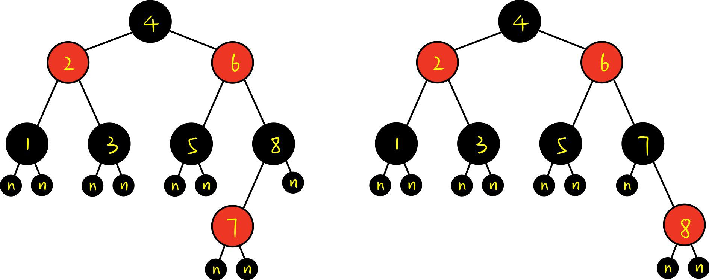

# 红黑树与哈希表

## 红黑树

### 特性

1. 节点分为红黑两色
2. 根节点为黑色
3. 叶子节点为黑色且值为空
4. 红色节点的子节点为黑色
5. 任意节点到其所有子孙叶节点经过相同数量的黑色节点

隐藏含义：任意节点到根节点的最长路径长度不超过最短路径的两倍

### 调整策略

1. 变色

2. 旋转（左旋，右旋）：不改变二叉搜索树的性质

   ```mermaid
   %%{
      init: {
         "flowchart": {
            "curve": "basis"
         }
      }
   }%%
   
   graph RL
      Right -- "Y左旋" --> Left
      Left -- "X右旋" --> Right
      subgraph Left
         direction TB
         X((X))
         Y((Y))
         A((A))
         B((B))
         C((C))
         R((R))
         R --> X
           X --> Y
           X --> C
           Y --> A
           Y --> B
       end
       subgraph Right
          direction TB
          XX((Y))
         YY((X))
         AA((B))
         BB((C))
         CC((A))
         RR((R))
         RR --> XX
           XX --> CC
           XX --> YY
           YY --> AA
           YY --> BB
       end
       style X stroke-width:2px,stroke-dasharray: 5 5
       style Y stroke-width:2px,stroke-dasharray: 5 5
       style XX stroke-width:2px,stroke-dasharray: 5 5
       style YY stroke-width:2px,stroke-dasharray: 5 5
   ```

### 插入（不使用旋转的理解方式）

1. 使用二叉搜索树的规则插入节点
2. 当前节点设置为红色（保证满足特性1，2，3，5）
3. 若父节点为黑色，则成立满足所有特性；若父节点为红色，则不满足特性4，使用调整策略使得满足特性4（思路：逐步向上调整，若最后根节点为红色，则直接改为黑色，依然满足所有特性）

- 父节点为红，父节点的兄弟节点为红。

  若修改后now指向根节点，则直接改为黑色并结束；否则递归向上继续进行。

  

- 父节点为红，父节点的兄弟节点为黑。

  取出（当前节点+父节点+祖父节点）重构为三角形并变色为（黑-红红），再连接所有分支。结束插入。

  

### 插入（以234树为基础）

#### 234树：三种节点类型的多叉搜索树



插入规则：使用搜索树规则插入节点。如果出现5节点的情况，将其中的第二个数据上溢，与其父节点合并。



#### 红黑树与234树的转换关系

将3节点补为4节点（两种补的方法），4节点的中间视为黑色父节点节点，左右视为红色根节点。以上右图为例。

红黑树每个黑节点对应234树中的一个节点。



#### 红黑树插入与234树插入的关系

1. 插入使得2节点->3节点（父节点为黑），直接插入红节点即可。
2. 插入使得3节点->4节点（父节点为红，父节点的兄弟节点为黑），实质为[非选择插入](###插入（不使用旋转的理解方式）)的第二种调整情况。
   - LL（左图插入6.5），RR（右图插入8.5）：染色+8右旋，染色+7左旋
   - LR（左图插入7.5），RL（右图插入7.5）：染色+7左炫+8右旋，染色+8右旋+7左旋
   - （左图插入8.5），（右图插入6.5）：直接插入红节点
3. 插入使得4节点->5节点（父节点为红，父节点的兄弟节点为红）：染色递归上移。参考[非选择插入](###插入（不使用旋转的理解方式）)的第一种调整情况。

### 删除（以234树为基础）

#### 插入和删除思路对比

插入：搜索树的插入均在叶子节点处（冲突最小），插入后若出现冲突，将冲突递归上移并解决。

删除：将要删除的节点移动到（非空）叶子节点再删除（冲突最小），再对删除后的冲突进行上移解决。

#### 删除步骤

1. 如果当前节点不是（非空）叶子节点，则寻找当前节点的中序遍历直接前驱或直接后继，交换值。
2. 当前节点一定在234树的叶子节点上，但不一定是红黑树的叶子节点。
   - 当前节点为4节点或3节点中的边缘节点（当前节点为红色），则直接删除；否则
   - 当前节点为3节点中的中间节点（当前节点为黑色，有一个非空子节点）：与子节点交换位置，删除。
   - 当前节点为2节点（当前节点为黑色，且没有非空子节点）
     - 当前节点为根节点，全部删除。
     - 当前节点的兄弟节点为黑色，且兄弟节点有红色子节点，将（父节点，兄弟节点，兄弟节点的一个子节点）按照（父节点颜色-黑黑）排列。类比[非选择插入](###插入（不使用旋转的理解方式）)的第二种调整情况。（也可以通过旋转理解）
     - 当前节点的兄弟节点为黑色，且兄弟节点没有红色子节点，若父节点为红，则将父节点染黑，兄弟节点染红；若父节点为黑，将兄弟节点染红，父节点作为当前节点进行递归操作。
     - 当前节点的兄弟节点为红色，则对父节点进行右旋（当前节点为右子节点），左旋（当前节点为左子节点），兄弟节点染黑，父节点染红，转化为上面两种情况。

## 哈希表

1. key->hash函数->hash值：在某个区间内
2. 解决hash冲突问题：即不同key值对应相同hash值
   - 链地址法：使用链表（buket）或红黑树在同一个地址存储。
   - 开放定址法：通过线性，平方，伪随机，双hash探查法（h1产生0\~(m-1)的数，h2产生1\~(m-1)且与m互素的数，使得h1+kh2可以探查整个hashtable）。
   - 再哈希法：定义hash函数族，发生冲突时使用下一个哈希函数，直到不产生冲突。
   - 公共溢出区：溢出数据统一存放。

### unordered_map原理

使用hashtable+buket的方式存储：在hash值相同（hash冲突）时以链表的形式实现buket，当单点数据量大于8时改为使用红黑树实现（单点的数据）。

只需要查重的话unordered_set即可
